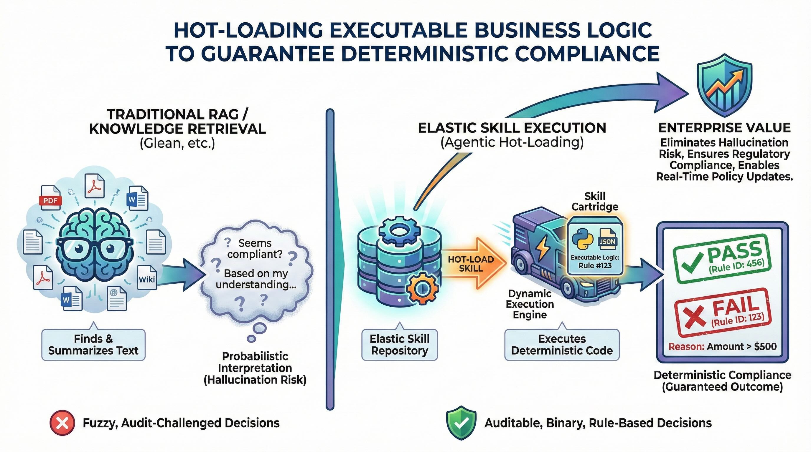

# Elastic Agent Skills Repository (Demo)

A demonstration of using Elasticsearch as a backend for Claude agent skills via the Model Context Protocol (MCP). This repository contains Python scripts, JSON configurations, and sample domain-specific skills showcasing proprietary business logic retrieval.



## Quick Start

### 1. Install Dependencies

```bash
uv sync
```

### 2. Configure Environment

Create a `.env` file with your Elasticsearch and Kibana credentials:

```bash
ELASTIC_SEARCH_URL=https://your-elasticsearch-instance.elastic.cloud
KIBANA_URL=https://your-kibana-instance.elastic.cloud
ELASTIC_API_KEY=your_api_key_here
```

### 3. Create the Workflow in Kibana

1. Go to **Kibana → Management → Workflows**
2. Create a new workflow using the contents of `agent_builder/workflows/agent_skills_operator.yaml`
3. Copy the workflow ID from the URL (e.g., `workflow-910a3d13-44e8-491d-bc3f-52ac1946f9a7`)
4. Update `agent_builder/tools/consultant_skills_operator.json` with your workflow ID:
   ```json
   {
     "configuration": {
       "workflow_id": "YOUR_WORKFLOW_ID_HERE",
       "wait_for_completion": true
     }
   }
   ```

### 4. Setup (Create Tools & Agents)

```bash
./init.sh
```

This registers MCP tools and agents with Kibana. Follow the "Next Steps" output to start the API server and Cloudflare tunnel.

### 5. Start Claude with Environment Loaded

```bash
export $(cat .env | xargs) && claude
```

### 6. Teardown (Clean Slate)

To delete all tools and agents for a fresh rebuild:

```bash
./init.sh --delete-all
```

## Documentation

- **[DEMO_SCRIPT.md](DEMO_SCRIPT.md)** - Example dialogue showcasing skill hot-loading
- **[AGENT_BUILDER.md](AGENT_BUILDER.md)** - Complete Agent Builder integration guide
- **[TESTING.md](TESTING.md)** - Comprehensive testing guide

## Architecture

- **Language:** Python 3.10+
- **Package Manager:** `uv` (modern Python package installer)
- **Search Backend:** Elasticsearch Serverless (semantic_text with Jina embeddings)
- **Interface:** MCP (Model Context Protocol)
- **Structure:**
  - `/config`: JSON mappings and settings for Elasticsearch indices
  - `/scripts`: Ingestion and management scripts
  - `/sample_skills`: Directory containing markdown/Python content for skills
  - `/mcp`: Tool definitions for Agent Builder

## Prerequisites

1. **Python 3.10+** installed on your system
2. **uv package manager** - Install with:
   ```bash
   curl -LsSf https://astral.sh/uv/install.sh | sh
   ```
3. **Elasticsearch Serverless instance**
   - Search URL and API Key for authentication
   - Configured with Jina embeddings inference endpoint (`.jina-embeddings-v3`)

## Setup Instructions

### 1. Install Dependencies

Use `uv` to sync the project dependencies:

```bash
uv sync
```

This will install all required packages defined in `pyproject.toml`, including:
- `elasticsearch` - Python client for Elasticsearch
- `python-dotenv` - Environment variable management
- `pytest` - Testing framework
- `pytest-json-report` - JSON test report generation

### 2. Configure Environment Variables

Create a `.env` file in the project root with your Elasticsearch credentials:

```bash
ELASTIC_SEARCH_URL=your_search_url_here
ELASTIC_API_KEY=your_api_key_here
```

**Note:** These credentials are required for ingestion and search operations. If you don't have them, the scripts will produce syntax-valid code but cannot execute against a real Elasticsearch instance.

### 3. Verify Configuration Files

Validate the JSON configuration files:

```bash
# Check index mappings
python -m json.tool config/index_mappings.json

# Check index settings
python -m json.tool config/index_settings.json

# Check MCP tool definitions
python -m json.tool mcp/tools.json
```

## Implementation Plan

Follow these steps to set up and run the demo:

### Step 1: Initialize Elasticsearch Index

The ingestion script will automatically create the `agent_skills` index if it doesn't exist, using the mappings and settings from the `/config` directory.

### Step 2: Ingest Sample Skills

Run the ingestion script to index all skills from the `sample_skills` directory:

```bash
uv run scripts/ingest_skills.py
```

This script will:
- Scan the `sample_skills` directory for subdirectories containing `SKILL.md` files
- Parse each skill's metadata (name, domain, tags, description)
- Create documents with the skill content and metadata
- Index documents to Elasticsearch (embeddings generated automatically via semantic_text inference)

**Expected Output:**
```
Successfully indexed skill: verify-expense-policy (ID: verify-expense-policy)
Successfully indexed skill: adjudicate-storm-claim (ID: adjudicate-storm-claim)
Successfully indexed skill: validate-sample-viability (ID: validate-sample-viability)
Ingestion complete: 3 skills indexed.
```

### Step 3: Test Search Functionality

Use the search test script to run semantic searches against Elasticsearch:

```bash
# Search for skills related to "expense"
uv run scripts/search_test.py --query "expense"

# Search with domain filter
uv run scripts/search_test.py --query "storm claim" --domain insurance

# Limit results
uv run scripts/search_test.py --query "sample viability" --limit 3
```

This script connects to your Elasticsearch instance and performs semantic searches using the `semantic_content` field.

### Step 4: Integrate with Agent Builder

Use the MCP tool definitions in `agent_builder/tools/` to integrate with your Claude agent:

1. **search_skills** - Semantic and full-text search across skills
2. **get_skill_files** - Retrieve all files for a skill (Python, JSON, CSV)
3. **list_skills_by_domain** - Filter skills by domain (finance, insurance, life_sciences)
4. **get_skill_metadata** - Get metadata without full content
5. **search_skills_by_tags** - Search skills by tags

## Agent Builder Integration

This repository includes Agent Builder MCP tools that enable Claude agents to search and retrieve skills directly through Kibana's Agent Builder API using ES|QL queries.

### Quick Start

#### 1. Configure Environment Variables

Add Kibana credentials to your `.env` file:

```bash
KIBANA_URL=https://your-kibana-instance.elastic.cloud
ELASTIC_MCP_URL=https://your-kibana-instance.elastic.cloud/api/agent_builder/mcp
ELASTIC_API_KEY=your_api_key_here
```

#### 2. Register Agent Builder Tools

```bash
# Validate tool definitions (dry run)
uv run scripts/register_agent_builder_tools.py --dry-run

# Register all tools with Kibana
uv run scripts/register_agent_builder_tools.py --register
```

#### 3. Test Tools via MCP Endpoint

```bash
# Test a specific tool
uv run scripts/test_agent_builder_tools.py \
  --tool search_skills \
  --params '{"query": "expense policy", "limit": 5}'

# Run all tests
uv run scripts/test_agent_builder_tools.py --all

# Run pytest test suite
uv run pytest tests/test_agent_builder_mcp.py -v
```

### Available Tools

| Tool | Description | ES|QL Query |
|------|-------------|--------------|
| `search_skills` | Semantic + full-text search | `FROM agent_skills METADATA _score \| WHERE name: ?query OR description: ?query OR ... \| SORT _score DESC` |
| `get_skill_files` | Retrieve all files for a skill | `FROM agent_skill_files \| WHERE skill_id == ?skill_id` |
| `list_skills_by_domain` | List skills in domain | `FROM agent_skills \| WHERE domain == ?domain \| SORT rating DESC` |
| `get_skill_metadata` | Get lightweight metadata | `FROM agent_skills \| WHERE skill_id == ?skill_id \| KEEP skill_id, name, domain, tags, ...` |
| `search_skills_by_tags` | Search by tags | `FROM agent_skills \| WHERE tags_str RLIKE ?tag` |

### Management Commands

```bash
# List registered tools
uv run scripts/register_agent_builder_tools.py --list

# Update a specific tool
uv run scripts/register_agent_builder_tools.py --update search_skills

# Delete a tool
uv run scripts/register_agent_builder_tools.py --delete search_skills
```

### Example: Search and Retrieve Workflow

```python
from scripts.test_agent_builder_tools import MCPToolTester
import os

# Initialize tester
tester = MCPToolTester(
    mcp_url=os.getenv('ELASTIC_MCP_URL'),
    api_key=os.getenv('ELASTIC_API_KEY')
)

# Search for skills
results = tester.test_tool('search_skills', {
    'query': 'expense policy validation',
    'limit': 3
})

# Get skill files
if results.get('results'):
    skill_id = results['results'][0]['skill_id']
    files = tester.test_tool('get_skill_files', {'skill_id': skill_id})
    print(f"Retrieved {len(files['results'])} files for skill: {skill_id}")
```

### Agent Builder Documentation

For comprehensive documentation on Agent Builder tools, see:
- **[AGENT_BUILDER.md](AGENT_BUILDER.md)** - Complete guide with ES|QL patterns, troubleshooting, and examples
- **Tool Definitions**: `agent_builder/tools/` - JSON definitions for all tools
- **ES|QL Queries**: `agent_builder/queries/` - Raw query files for testing

## Sample Skills

This repository includes three domain-specific skills with proprietary business logic:

### 1. Verify Expense Policy (Finance)
**Location:** `sample_skills/verify-expense-policy/`

**Proprietary Rules:**
- Expenses > $500 require VP_APPROVAL
- Team_Dinner category capped at $75/head
- Software category requires pre-existing Procurement_Ticket_ID

**Files:**
- `SKILL.md` - Instructions and usage
- `policy_check.py` - Business rule implementation
- `allowance_table.json` - Configuration data

**Usage:**
```bash
uv run sample_skills/verify-expense-policy/policy_check.py
```

### 2. Adjudicate Storm Claim (Insurance)
**Location:** `sample_skills/adjudicate-storm-claim/`

**Proprietary Rules:**
- Storm category ≥3 waives deductible
- Wood shake roofs in coastal regions denied unless retrofit_year > 2020
- Material/region risk matrix applies coverage multipliers

**Files:**
- `SKILL.md` - Instructions and usage
- `adjudicator.py` - Claim adjudication logic
- `risk_matrix.csv` - Risk scoring matrix

**Usage:**
```bash
uv run sample_skills/adjudicate-storm-claim/adjudicator.py
```

### 3. Validate Sample Viability (Life Sciences)
**Location:** `sample_skills/validate-sample-viability/`

**Proprietary Rules:**
- Plasma-EDTA samples must be processed within 4 hours
- Turbidity index > 0.8 requires ultracentrifugation
- Storage temperature must be between -80°C and -70°C (strict)
- Minimum volume requirements vary by sample type

**Files:**
- `SKILL.md` - Instructions and usage
- `viability_check.py` - Sample validation logic
- `biomarker_constraints.json` - Sample type constraints

**Usage:**
```bash
uv run sample_skills/validate-sample-viability/viability_check.py
```

## Project Structure

```
elastic-claude-agent-skill-demo/
├── config/
│   ├── index_mappings.json      # Elasticsearch field mappings
│   └── index_settings.json      # Index configuration (analyzers, etc.)
├── scripts/
│   ├── ingest_skills.py                   # Ingestion script (uses semantic_text inference)
│   ├── search_test.py                     # Semantic search test utility
│   ├── run_e2e_tests.py                   # End-to-end test runner
│   ├── validate_indexing.py               # Index validation script
│   ├── register_agent_builder_tools.py    # Agent Builder tool registration
│   ├── test_agent_builder_tools.py        # Agent Builder tool testing
│   └── test_esql_queries.py               # ES|QL query testing utility
├── agent_builder/
│   ├── tools/                   # Agent Builder tool definitions (JSON)
│   │   ├── search_skills.json
│   │   ├── get_skill_files.json
│   │   ├── list_skills_by_domain.json
│   │   ├── get_skill_metadata.json
│   │   └── search_skills_by_tags.json
│   └── queries/                 # ES|QL query files for testing
│       ├── search_skills.esql
│       ├── get_skill_files.esql
│       ├── list_skills_by_domain.esql
│       ├── get_skill_metadata.esql
│       └── search_skills_by_tags.esql
├── sample_skills/
│   ├── verify-expense-policy/
│   │   ├── SKILL.md
│   │   ├── policy_check.py
│   │   └── allowance_table.json
│   ├── adjudicate-storm-claim/
│   │   ├── SKILL.md
│   │   ├── adjudicator.py
│   │   └── risk_matrix.csv
│   └── validate-sample-viability/
│       ├── SKILL.md
│       ├── viability_check.py
│       └── biomarker_constraints.json
├── tests/
│   ├── conftest.py                   # pytest fixtures and helpers
│   ├── test_expense_policy.py        # Finance scenario tests
│   ├── test_storm_claim.py           # Insurance scenario tests
│   ├── test_sample_viability.py      # Life Sciences scenario tests
│   └── test_agent_builder_mcp.py     # Agent Builder MCP tool tests
├── mcp/
│   └── tools.json                    # MCP tool definitions for Agent Builder
├── pyproject.toml                    # Project dependencies (managed by uv)
├── setup.sh                          # Setup script (indexes + MCP tools)
├── teardown.sh                       # Teardown script (delete all)
├── README.md                         # This file
├── AGENT_BUILDER.md                  # Agent Builder integration guide
├── DEMO_SCRIPT.md                    # Example dialogue showcasing hot-loading
└── TESTING.md                        # Comprehensive testing guide

```

## Troubleshooting

### uv command not found
Install uv using:
```bash
curl -LsSf https://astral.sh/uv/install.sh | sh
```

### Elasticsearch connection errors
- Verify your `ELASTIC_SEARCH_URL` and `ELASTIC_API_KEY` are correct in the `.env` file
- Check that your Elasticsearch Serverless instance is running and accessible
- Ensure your API key has sufficient privileges (index creation, document indexing)
- Confirm the Jina embeddings inference endpoint (`.jina-embeddings-v3`) is configured

### Ingestion script fails
- Confirm all sample skill directories contain a `SKILL.md` file
- Check that Python syntax in all `.py` files is valid
- Verify JSON/CSV data files are properly formatted

### Import errors
Run `uv sync` to ensure all dependencies are installed:
```bash
uv sync
```

## End-to-End Testing

This repository includes a comprehensive end-to-end testing framework that validates the complete workflow: semantic search, skill retrieval, and execution.

### Running Search Tests

Test semantic search functionality against your Elasticsearch instance:

```bash
# Basic search query
uv run scripts/search_test.py --query "expense policy"

# Search with domain filter
uv run scripts/search_test.py --query "storm damage" --domain insurance

# Limit number of results
uv run scripts/search_test.py --query "sample viability" --domain life_sciences --limit 3
```

### Running End-to-End Tests

Execute the complete test suite covering all three demo scenarios:

```bash
# Run all tests with detailed output
uv run scripts/run_e2e_tests.py --verbose

# Generate test report (default: e2e-test-results.md)
uv run scripts/run_e2e_tests.py

# Specify custom output path
uv run scripts/run_e2e_tests.py --output my-test-results.md
```

### Running Specific Test Files

Use pytest directly to run individual test scenarios:

```bash
# Finance scenario (expense policy)
uv run pytest tests/test_expense_policy.py -v

# Insurance scenario (storm claim)
uv run pytest tests/test_storm_claim.py -v

# Life Sciences scenario (sample viability)
uv run pytest tests/test_sample_viability.py -v

# Run all tests
uv run pytest tests/ -v
```

### Example Test Output

```
Test Execution Summary
================================================================================
Total:   15
Passed:  15 ✅
Failed:  0
Skipped: 0
Duration: 4.36s

✅ Report generated: e2e-test-results.md
```

### What Gets Tested

The end-to-end tests validate:

- **Semantic Search Accuracy**: Queries return relevant skills using semantic_text field
- **Domain Filtering**: Results are correctly filtered by finance, insurance, or life_sciences
- **Skill Retrieval**: Skills can be retrieved by ID
- **Skill Execution**: Python code executes correctly with test inputs
- **Business Logic**: Proprietary rules produce expected outcomes
- **Edge Cases**: Boundary conditions and error handling

For more details, see [TESTING.md](TESTING.md).

## Development

### Adding New Skills

1. Create a new directory under `sample_skills/`:
   ```bash
   mkdir sample_skills/your-new-skill
   ```

2. Create a `SKILL.md` file with metadata:
   ```markdown
   # Skill: Your New Skill
   **Domain:** your_domain
   **Tags:** tag1, tag2, tag3
   **Description:** Brief description of what this skill does.

   ## Instructions
   [Your skill instructions here]
   ```

3. Add implementation files (Python scripts, JSON/CSV data, etc.)

4. Run the ingestion script to index the new skill:
   ```bash
   uv run scripts/ingest_skills.py
   ```

### Testing Skills Locally

Each skill can be executed independently for testing:

```bash
# Run with uv
uv run sample_skills/your-skill/script.py

# Or activate the virtual environment
source .venv/bin/activate
python sample_skills/your-skill/script.py
```

## License

This is a demonstration project for educational purposes.

## Support

For issues or questions about this demo, please refer to the Elasticsearch and MCP documentation:
- [Elasticsearch Python Client](https://www.elastic.co/guide/en/elasticsearch/client/python-api/current/index.html)
- [ES|QL Query Language](https://www.elastic.co/guide/en/elasticsearch/reference/current/esql.html)
- [Model Context Protocol](https://modelcontextprotocol.io/)
